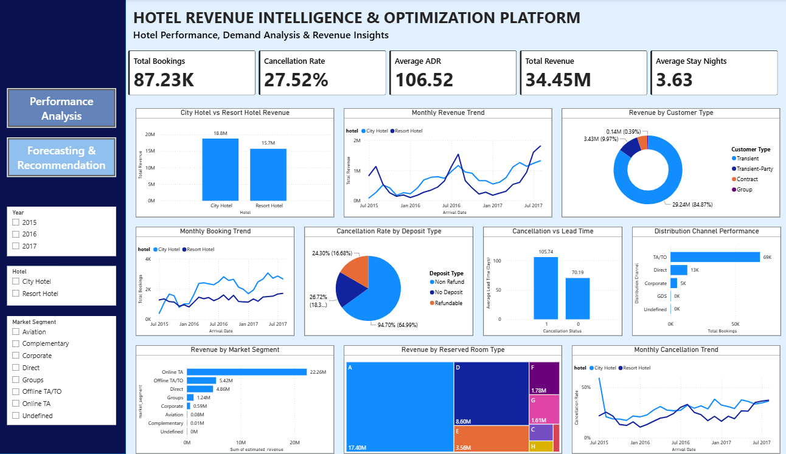
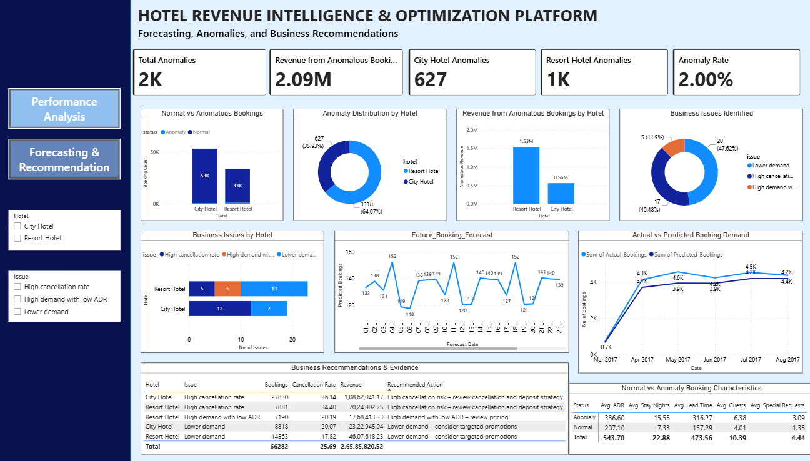

# Hotel Revenue Intelligence Dashboard

An end-to-end hotel analytics project that combines Python, SQL, machine learning, time-series forecasting, and Power BI to turn booking history into operational and revenue insights.

The project analyses City Hotel and Resort Hotel bookings, identifies unusual booking records, forecasts daily demand, and presents the results in a two-page interactive business intelligence dashboard.

## Contents

- [Project overview](#project-overview)
- [Business questions](#business-questions)
- [Highlights](#highlights)
- [Repository contents](#repository-contents)
- [Technology stack](#technology-stack)
- [Analytical workflow](#analytical-workflow)
- [Forecasting methodology](#forecasting-methodology)
- [Dashboard](#dashboard)
- [Results and insights](#results-and-insights)
- [How to use this repository](#how-to-use-this-repository)
- [Data and reproducibility notes](#data-and-reproducibility-notes)
- [Skills demonstrated](#skills-demonstrated)
- [Author](#author)

## Project overview

Hotel booking data contains valuable signals about demand, cancellations, customer behaviour, revenue, and operational workload. Those signals are distributed across booking-level records and are difficult to use directly for planning.

This project builds a repeatable analysis pipeline that:

1. Cleans and enriches hotel booking records.
2. Profiles historical booking and revenue behaviour.
3. Organises business metrics for SQL analysis.
4. Detects anomalous booking patterns with Isolation Forest.
5. Aggregates reservations into daily demand time series.
6. Compares baseline, statistical, and machine-learning forecasts.
7. Produces a 30-day forward demand forecast.
8. Communicates findings through an interactive Power BI report.

The resulting analysis is intended to support staffing, room and inventory planning, pricing, marketing, and anomaly monitoring.

## Business questions

The analysis addresses questions such as:

- How do booking volumes differ between City Hotel and Resort Hotel?
- Which months, market segments, and distribution channels contribute the most bookings and revenue?
- What patterns are associated with cancellations and lead time?
- Which booking records differ substantially from normal behaviour?
- How accurately can daily demand be forecast for each hotel type?
- What demand should operations teams plan for over the next 30 days?

## Highlights

| Area | Outcome |
| --- | --- |
| Historical data | Approximately 87,230 hotel booking records analysed |
| Hotels covered | City Hotel and Resort Hotel |
| Anomaly detection | 1,745 records identified with Isolation Forest |
| Forecast evaluation | 634 training days and 159 testing days |
| Forecast test period | 26 March 2017 to 31 August 2017 |
| Forward forecast | 1 September 2017 to 30 September 2017 |
| Dashboard | Two-page Power BI report |

## Repository contents

| Path | Description |
| --- | --- |
| [`Hotel Demand & Revenue Intelligence Dashboard.pbix`](./Hotel%20Demand%20%26%20Revenue%20Intelligence%20Dashboard.pbix) | Power BI report containing the interactive dashboard |
| [`Page1.png`](./Page1.png) | Preview of the hotel performance and booking analytics page |
| [`Page2.png`](./Page2.png) | Preview of the demand forecasting and recommendations page |
| [`SQL Analysis.sql`](./SQL%20Analysis.sql) | SQL schema and business analysis queries |
| [`Colab Notebooks/Hotel Intelligence EDA and Data Cleaning.ipynb`](./Colab%20Notebooks/Hotel%20Intelligence%20EDA%20and%20Data%20Cleaning.ipynb) | Data understanding, cleaning, and exploratory analysis |
| [`Colab Notebooks/Hotel Intelligence Data Preparation for SQL.ipynb`](./Colab%20Notebooks/Hotel%20Intelligence%20Data%20Preparation%20for%20SQL.ipynb) | Preparation of analysis-ready SQL datasets |
| [`Colab Notebooks/Revenue Booking Analysis.ipynb`](./Colab%20Notebooks/Revenue%20Booking%20Analysis.ipynb) | Revenue and booking-level analysis |
| [`Colab Notebooks/Anomaly Detection.ipynb`](./Colab%20Notebooks/Anomaly%20Detection.ipynb) | Isolation Forest anomaly detection |
| [`Colab Notebooks/Demand Forecasting.ipynb`](./Colab%20Notebooks/Demand%20Forecasting.ipynb) | Daily demand creation, model training, and forecast evaluation |
| [`Colab Notebooks/Recommendation Engine.ipynb`](./Colab%20Notebooks/Recommendation%20Engine.ipynb) | Forecast-informed business recommendations |

## Technology stack

- **Python:** data preparation, exploratory analysis, anomaly detection, and forecasting
- **Google Colab:** notebook execution environment
- **Pandas and NumPy:** tabular transformation and numerical analysis
- **Matplotlib:** exploratory visualisation
- **Scikit-learn:** Isolation Forest and Random Forest models
- **Statsmodels:** SARIMA time-series forecasting
- **SQL:** structured business analysis and KPI aggregation
- **Power Query:** Power BI data preparation
- **DAX:** Power BI measures and KPIs
- **Power BI:** interactive reporting and decision support

## Analytical workflow

### 1. Data understanding and preparation

The booking data is inspected for structure, types, missing values, and business meaning. Date fields are standardised and analysis-ready fields are created, including:

- Arrival date
- Total stay nights
- Total guests
- Estimated revenue
- Data-quality flags for invalid ADR and guest counts

### 2. Exploratory and revenue analysis

The notebooks examine booking volume, hotel type, cancellations, lead time, stay length, customer type, market segment, distribution channel, and time-based trends. Revenue and booking metrics are compared across hotel types and business dimensions.

### 3. SQL business analysis

[`SQL Analysis.sql`](./SQL%20Analysis.sql) defines summary tables for daily demand, monthly performance, market segments, and distribution channels. It also includes queries for:

- Total bookings by hotel
- Cancellation rate by hotel
- Revenue and average ADR by hotel
- Monthly booking trends
- Top revenue-producing months
- Market segment performance
- Distribution channel performance

### 4. Anomaly detection

Isolation Forest is used to flag booking records with unusual combinations of booking and customer characteristics. The analysis identified **1,745 anomalous records**. These records are treated as investigation signals rather than automatic errors; they may represent unusual customer behaviour, data-quality issues, or rare but valid bookings.

### 5. Daily demand creation

Booking records are grouped by `arrival_date` and `hotel` to create daily demand series for City Hotel and Resort Hotel. This converts reservation-level data into a form suitable for time-series modelling.

### 6. Train/test evaluation

The daily series are divided into:

- **Training period:** 634 days
- **Testing period:** 159 days
- **Testing dates:** 26 March 2017 to 31 August 2017

The test period is held out to compare predicted demand with observed demand.

## Forecasting methodology

Three approaches are evaluated:

1. **Seven-day moving average:** a transparent baseline based on recent demand.
2. **SARIMA:** a statistical time-series model for trend and seasonal behaviour.
3. **Random Forest:** a machine-learning model using historical demand patterns.

Models are compared using:

- **MAE:** average absolute prediction error
- **RMSE:** error metric that gives more weight to large errors
- **MAPE:** percentage-based prediction error
- **Forecast bias:** tendency to systematically over- or under-predict

### Best test results

| Hotel | Best model | MAE | RMSE |
| --- | --- | ---: | ---: |
| City Hotel | SARIMA | 16.37 | 21.05 |
| Resort Hotel | Random Forest | 11.07 | 15.38 |

The selected model differs by hotel type because the two demand series do not necessarily exhibit the same trend, seasonality, or variability.

## Dashboard

The Power BI report contains two pages.

### Page 1 — Hotel Performance & Booking Analytics

This page provides a historical view of:

- Booking performance and key KPIs
- City Hotel versus Resort Hotel
- Booking and cancellation trends
- Lead-time and customer behaviour
- Market segment and distribution channel performance
- Anomaly insights

### Page 2 — Demand Forecasting & Business Recommendations

This page combines:

- Actual versus predicted daily demand
- Hotel-level forecast comparison
- 30-day future demand
- Interactive hotel filtering
- Recommendations for staffing, pricing, inventory, marketing, and anomaly monitoring

## Results and insights

### 30-day forward forecast

The forecast covers **1 September 2017 to 30 September 2017**.

| Hotel | Average daily demand | Minimum | Maximum | Total forecast |
| --- | ---: | ---: | ---: | ---: |
| City Hotel | 79.54 | 70.56 | 91.43 | 2,386.23 |
| Resort Hotel | 54.80 | 46.94 | 62.99 | 1,643.86 |

City Hotel is expected to have the higher booking demand throughout this forecast window. These figures should be used as planning estimates, not guaranteed reservations.

### Business implications

- **Staffing:** align front-desk, housekeeping, and service capacity with expected demand.
- **Pricing:** consider higher rates during strong-demand periods and targeted promotions during softer periods.
- **Room and inventory planning:** use demand expectations to plan availability, supplies, and housekeeping schedules.
- **Marketing:** target promotions at periods where demand is expected to be lower.
- **Anomaly monitoring:** investigate unusual records before using them in operational or revenue decisions.

## How to use this repository

### View the finished dashboard

1. Install [Power BI Desktop](https://powerbi.microsoft.com/desktop/).
2. Open [`Hotel Demand & Revenue Intelligence Dashboard.pbix`](./Hotel%20Demand%20%26%20Revenue%20Intelligence%20Dashboard.pbix).
3. If Power BI requests a data-source refresh, update the source location to match your local prepared data.
4. Use the hotel filters and visuals to explore historical performance and forecasts.

The PNG files provide a quick preview without requiring Power BI Desktop.

### Re-run the notebooks

The notebooks are designed for Google Colab and currently reference a Google Drive data directory. To reproduce the analysis:

1. Open the relevant notebook in Google Colab.
2. Provide the cleaned input file expected by the notebook, such as `hotel_bookings_cleaned.csv`.
3. Update the `base_path` variable to the location of your data.
4. Run the notebooks in this order:
   1. EDA and data cleaning
   2. Data preparation for SQL
   3. Revenue booking analysis
   4. Anomaly detection
   5. Demand forecasting
   6. Recommendation engine
5. Export or connect the resulting datasets to Power BI.

### Run the SQL analysis

1. Use a SQL environment compatible with the `CREATE DATABASE`, `CREATE TABLE`, and `LIMIT` syntax in [`SQL Analysis.sql`](./SQL%20Analysis.sql).
2. Create the `hotel_revenue` database.
3. Load the prepared summary data into the four tables defined by the script.
4. Run the included KPI and performance queries.

## Data and reproducibility notes

- The repository contains analysis artifacts, notebooks, SQL, and the Power BI report; the source CSV is not included.
- Notebook paths are environment-specific and must be updated before running outside the original Google Drive setup.
- Forecast totals contain decimal values because they represent model estimates aggregated across daily predictions.
- Forecast performance is based on the stated historical train/test split and may change if the input data, feature preparation, or model settings change.
- Anomalies are candidates for review, not proof of fraudulent activity or incorrect data.

## Skills demonstrated

Data cleaning and preprocessing · exploratory data analysis · revenue analysis · SQL business analysis · data visualisation · feature engineering · Isolation Forest · time-series analysis · moving-average baselines · SARIMA · Random Forest · model evaluation · MAE · RMSE · MAPE · forecast bias · Power Query · DAX · Power BI dashboard design · business intelligence · decision support

## Author

**Tanuja Gunjal**  
Aspiring Data Analyst | Business Intelligence | Power BI | Tableau | SQL | Python

